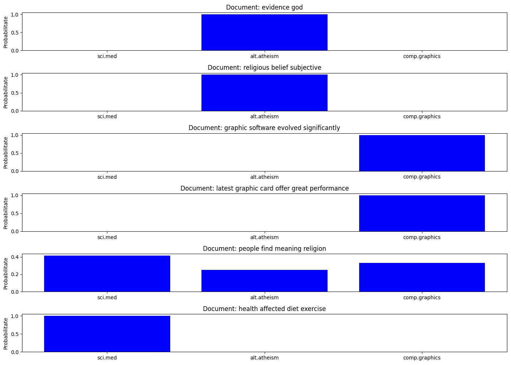

# Naive Bayes Text Classification Projects

These projects demonstrate the application of the Naive Bayes classifier to text classification tasks using different preprocessing techniques. The first project uses stemming to process text data from the `20 Newsgroups` dataset to classify text into categories such as `alt.atheism`, `comp.graphics`, and `sci.med`. The second project uses lemmatization on a fictional dataset to classify text snippets by their simulated content type.

## Contents

- [Project Setup](#project-setup)
- [Mathematical Model](#mathematical-model)
- [Implementation Details](#implementation-details)
- [Evaluation and Results](#evaluation-and-results)
- [References](#references)

## Project Setup

### Dependencies

- Python 3.x
- NumPy
- Scikit-Learn
- NLTK
- Matplotlib

### Installation

To install necessary libraries, run:
```bash
pip install numpy matplotlib scikit-learn nltk
```

Ensure NLTK datasets are downloaded using:
```python
import nltk
nltk.download('stopwords')
nltk.download('wordnet')
```

## Mathematical Model

The core of our classifier is based on Bayes' Theorem, which in the context of our problem is formulated as:

$$
P(C_k \mid x) = \frac{P(x \mid C_k) \cdot P(C_k)}{P(x)}
$$

Where:
- $P(C_k \mid x)$ is the posterior probability of class $C_k$ given predictor(s) $x$.
- $P(x \mid C_k)$ is the likelihood which is the probability of predictor given class $C_k$.
- $P(C_k)$ is the prior probability of class $C_k$.
- $P(x)$ is the prior probability of the predictor.

This theorem allows us to calculate the probability of a class based on the presence of features in the data.

### Preprocessing Techniques

- **Stemming Project:** Utilizes PorterStemmer to reduce words to their word stems.
- **Lemmatization Project:** Employs WordNetLemmatizer to reduce words to their lemmatized form based on their parts of speech.

### Probability Calculations

- **Prior Probabilities** are computed based on the frequency of each class in the training dataset.
- **Conditional Probabilities** are adjusted using Laplace smoothing to avoid zero probability issues.

## Implementation Details

### Data Preparation

Both projects preprocess text data:
- **Stemming:** Converts text to lowercase, removes numbers and special characters, and applies stemming.
- **Lemmatization:** Converts text to lowercase, removes numbers and special characters, and applies lemmatization.

### Vectorization

Text data is transformed into a vector space model using TF-IDF vectorization, considering the frequencies of terms adjusted by their inverse document frequency.

### Classification

Using the precomputed probabilities, the classifier calculates the log probabilities for each class and predicts the class with the highest log probability to mitigate underflow issues.


## Evaluation and Results

## Results Visualization

Here are visual representations of the classifier's performance and other analytical results:

### Model Accuracy and Predictions

This image shows the accuracy and the count of correct and incorrect predictions by the model:


### Classification Probabilities

This image provides a detailed view of the probability distributions for each classified document:




## References

- [Naive Bayes - Scikit-Learn](https://scikit-learn.org/stable/modules/naive_bayes.html)
- [Naive Bayes Classifiers - Towards Data Science](https://towardsdatascience.com/naive-bayes-classifier-81d512f50a7c)
- [TF-IDF for Text Mining](https://monkeylearn.com/blog/what-is-tf-idf/)
- [Text Preprocessing Techniques](https://www.analyticsvidhya.com/blog/2021/06/text-preprocessing-in-nlp-with-python-codes/)
- [Evaluation Metrics for Classification Models](https://towardsdatascience.com/evaluation-metrics-for-classification-models-18ac56f2b5f2)
- [Introduction to Machine Learning](https://machinelearningmastery.com/what-is-machine-learning/)
- [A Friendly Introduction to Machine Learning](https://www.analyticsvidhya.com/blog/2020/02/a-friendly-introduction-to-machine-learning/)
- [Naive Bayes Tutorial - YouTube](https://www.youtube.com/watch?v=TLInuAorxqE)

